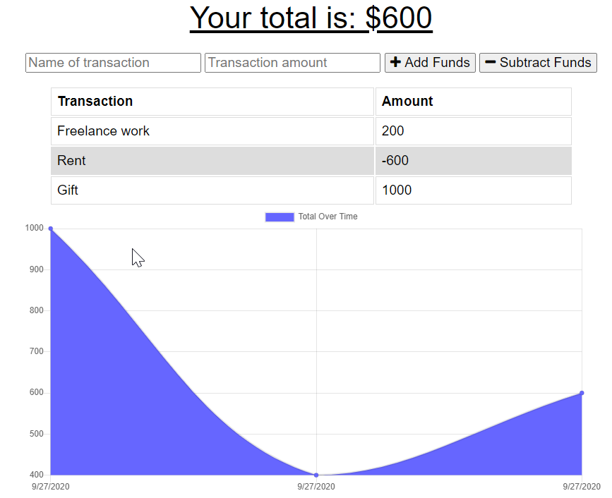

# budget-tracker-pwa

## Description 
This is a Budgest Tracker app that was created to help track expenses and manage your budget. This is a progressive web application with offline functionality. 

## Deployed/Heroku URL

## Github Repo URL
https://github.com/asaldana1108/budget-tracker-pwa

## Badges

## Table of Contents

* [Installation](#installation)
* [License](#license)
* [Questions](#questions)

## Installation
Use the online app or download the PWA. 
If downloading the codebasd, run the following command after cloning the database "npm install" to install dependencies.

## License
MIT
---

## Questions
For any additional questions, here is my contact information. 
* [GitHub] (github.com/asaldana1108)
* [Email] (asaldana1108@gmail.com)